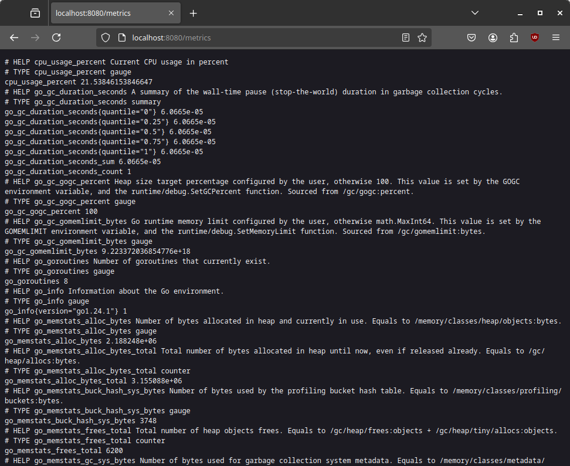

**Observātor** is a system monitoring tool built in Go that leverages resources provided by Prometheus, an open-source solution.

This document shows the whole development process for educational purposes.

## Phase 1: Setup and Basic Metric Collection

### Setting up the development environment

First, let's install Go by downloading the latest stable distribution from Go's Official Website ([https://go.dev/](https://go.dev/)) or by using a package manager. For example, for Debian's APT:

```sh
$ sudo apt install golang
```

> Note: Sometimes, the packages are not up to the latest version, so you might end up installing an older version of Go. When downloading manually, follow the specific installation instructions for your operating system.

Next, we will set up a directory, change to it and initialize the project with `go mod init`:

```sh
$ go mod init github.com/████████/observator
go: creating new go.mod: module github.com/████████/observator
go: to add module requirements and sums:
        go mod tidy
```

Note that we are not initializing the project with `go mod init observator`, but actually "linking" our Go module to the name of our GitHub repo. This way, we are following Go's conventions and making it easier for other devs to locate our work. In fact, Go recognizes `github.com` and understands that this is a GitHub repo, thus invoking `git clone` and automating the cloning process.

Now we'll open **Code** (or **Codium**) and create a file in the project root called `main.go`.

### Initializing the `gopsutil` library

Now we'll install `gopsutil`, a cross-platform library for retrieving system information. We do this by typing `go get github.com/shirou/gopsutil/cpu` (now the previous explanation about naming makes sense!):

```bash
$ go get github.com/shirou/gopsutil/cpu
go: downloading github.com/shirou/gopsutil v3.21.11+incompatible
go: downloading github.com/tklauser/go-sysconf v0.3.15
go: downloading github.com/yusufpapurcu/wmi v1.2.4
go: downloading golang.org/x/sys v0.31.0
go: downloading github.com/tklauser/numcpus v0.10.0
go: downloading github.com/go-ole/go-ole v1.2.6
go: added github.com/go-ole/go-ole v1.2.6
go: added github.com/shirou/gopsutil v3.21.11+incompatible
go: added github.com/tklauser/go-sysconf v0.3.15
go: added github.com/tklauser/numcpus v0.10.0
go: added github.com/yusufpapurcu/wmi v1.2.4
go: added golang.org/x/sys v0.31.0
```

### Coding the Metric Collector

Now we'll code a very basic metric collector. The logic goes like this:

1. We'll invoke the `Percent` method in the `cpu` library in order to get the CPU usage percentage and display either the percentage (if successful) or an error message (otherwise). For this, we need to import the `fmt` and `cpu` libraries.

2. We'll put this code in an infinite loop with a one second pause between each call. For this, we need to import the `time` library.

The code will look like this:

```go
package main

import (
    "fmt"
    "time"

    "github.com/shirou/gopsutil/cpu"
)

func main() {
    for {
        percent, err := cpu.Percent(time.Second, false)
        if err != nil {
            fmt.Println("Error getting CPU usage:", err)
            return
        }
        fmt.Printf("CPU Usage: %.2f%%\n", percent[0])
        time.Sleep(time.Second)
    }
}
```

Now we save and run the code with `go run`:

```sh
$ go run main.go
CPU Usage: 9.69%
CPU Usage: 9.23%
CPU Usage: 11.79%
CPU Usage: 7.77%
CPU Usage: 7.65%
...
```

Since we defined a continuous loop, the percentage will update each second until we stop the script with **CTRL+C**.

Great! Our code works and shows us the CPU usage.

## Phase 2: Prometheus Integration

For this phase to work, we need to install the Prometheus Client Library. This is done by downloading three separate libraries:

```sh
$ go get github.com/prometheus/client_golang/prometheus
go: added toolchain go1.24.1
go: added github.com/beorn7/perks v1.0.1
go: added github.com/cespare/xxhash/v2 v2.3.0
go: added github.com/munnerz/goautoneg v0.0.0-20191010083416-a7dc8b61c822
go: added github.com/prometheus/client_golang v1.21.1
go: added github.com/prometheus/client_model v0.6.1
go: added github.com/prometheus/common v0.62.0
go: added github.com/prometheus/procfs v0.15.1
go: added google.golang.org/protobuf v1.36.1

$ go get github.com/prometheus/client_golang/prometheus/promauto

$ go get github.com/prometheus/client_golang/prometheus/promhttp
go: downloading github.com/klauspost/compress v1.17.11
```

* `prometheus`, the base prometheus library.
* `promauto`, a helper library for automatically registering metrics.
* `promhttp`, a library that handles exposing prometheus metrics over http.

> Note: Go modules use the `go.mod` and `go.sum` files to ensure consistent builds. The `go.mod` file specifies the required dependencies and their versions, while the `go.sum` file provides checksums to verify the integrity of the downloaded modules. This ensures that everyone who builds the project uses the same versions of the dependencies.

Now we make some modifications to the code:

First, we add dependencies to `log`, `net/http` and the three Prometheus libraries.

Next, we'll create a Prometheus Gauge metric named `cpu_usage_percent` and store it as `cpuUsage`. A Gauge is used for metrics that can increase or decrease (CPU usage is a great example). In order to register the gauge, we call `promauto.NewGauge()`.

> Note: A Gauge is a Prometheus metric type that represents a single numerical value that can arbitrarily go up and down. It is typically used for measured values like temperatures or current memory usage. Because CPU usage fluctuates, a gauge is the correct type of metric to use.

Now we need a way to update the `cpuUsage` gauge and, for that, we define a function, `collectCPUUsage()`. Instead of `fmt.Println`, we will use `log.Println` because it's a better practice for programs that are intended to be long running.

Finally, in the `main()` function, we start the `collectCPUUsage()` function as a [Goroutine](https://go.dev/tour/concurrency/1), so it runs concurrently.

> Note: A goroutine is a lightweight thread of execution in Go. We use a goroutine to run the `collectCPUUsage()` function concurrently, allowing it to continuously collect CPU usage metrics without blocking the main thread, which handles the HTTP server.

Finally, we start an HTTP server and set up an HTTP handler for the /metrics endpoints using `promhttp.Handler()`.

The result will look like this:

```go
package main

import (
	"fmt"
	"log"
	"net/http"
	"time"

	"github.com/prometheus/client_golang/prometheus"
	"github.com/prometheus/client_golang/prometheus/promauto"
	"github.com/prometheus/client_golang/prometheus/promhttp"
	"github.com/shirou/gopsutil/cpu"
)

var cpuUsage = promauto.NewGauge(prometheus.GaugeOpts{
	Name: "cpu_usage_percent",
	Help: "Current CPU usage in percent",
})

func collectCPUUsage() {
	for {
		percent, err := cpu.Percent(time.Second, false)
		if err != nil {
			log.Println("Error getting CPU usage:", err)
			return
		}
		cpuUsage.Set(percent[0])
		time.Sleep(time.Second)
	}
}

func main() {
	go collectCPUUsage()

	http.Handle("/metrics", promhttp.Handler())
	fmt.Println("Starting server on :8080")
	log.Fatal(http.ListenAndServe(":8080", nil))
}
```

> Note: In a production environment, robust error handling is crucial. While we handle errors in the CPU usage collection, we should also consider adding error handling for other operations, such as the HTTP server. This ensures that the application can gracefully handle unexpected situations and continue to operate.

Now we run the script and wait for the "server up" message:

```
$ go run main.go
Starting server on :8080
```

And finally, upon browsing to `http://localhost:8080/metrics`, we will see something like this:



This text is simply the CPU usage percentage in Prometheus format. Let's quickly break it down:

* **HELP cpu_usage_percent Current CPU usage in percent**: This is a comment that provides a description of the cpu_usage_percent metric. Prometheus uses these comments to display helpful information in its UI.

* **TYPE cpu_usage_percent gauge**: This line specifies the type of metric.

* **cpu_usage_percent 21.53846153846647**: This is the actual metric value. It shows that the CPU usage is currently around 21.54%.

* **Other Metrics (Starting with go_... and process_...)**: These are metrics that are automatically exposed by the Prometheus client library.
    * `go_` metrics provide information about the Go runtime (e.g., memory usage, garbage collection).
    * `process_` metrics provide information about the process itself (e.g., CPU time, memory usage, open file descriptors).
    * `promhttp_` metrics provide information about the Prometheus http handler.

Done! The module is now functional and shows us the CPU usage.
